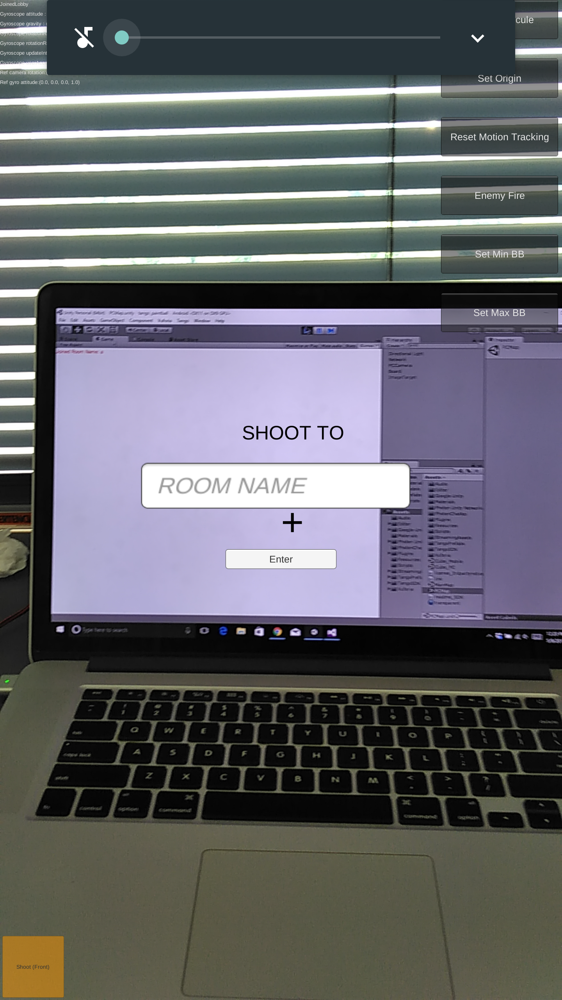
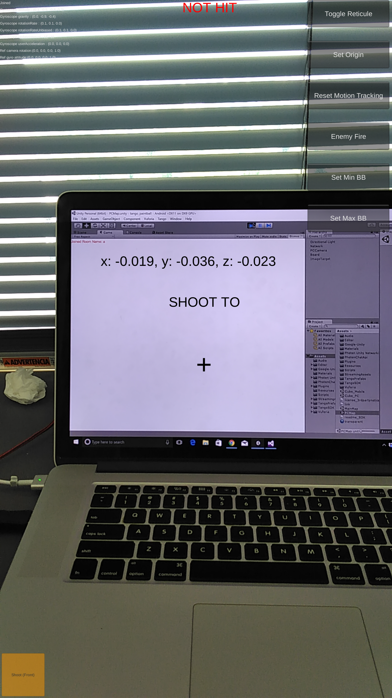
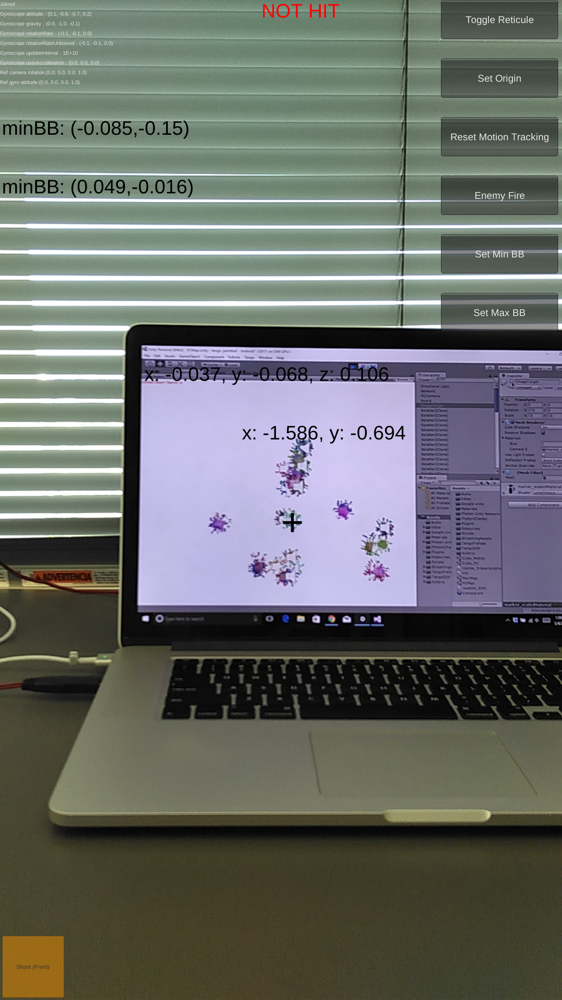
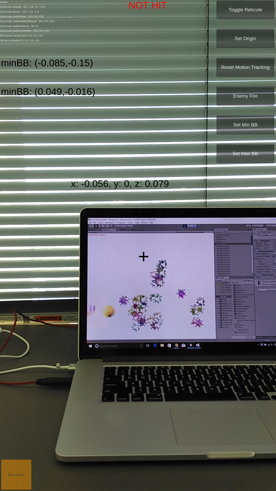

# Spring 2017 Google Tango Independent Study

* Joseph Gao
* Mentor: Steven Lane

# Introduction

The goal of this independent study was to evaluate and learn about the potential impact Google's new Tango technology would have in an educational setting. I attempted to develop a proof of concept demo by rewriting an existing Vuforia AR based Paintball app using Tango APIs and functionality. 

# Work accomplished 

- Throughout the course of this project I was able to gain invaluable experience working with Google's new Tango technology, and was able to better understand both the limitations and highlights of its hardware. 

## Tango Specific
- Modularized code for future users to be able to perform any number of refernce frame transformations to any coordinate system starting from a base `START_OF_SERVICE` frame initiated by Tango.
- Created a portable framework for easy integration of Tango depth, motion, and reference frame change features into any Unity app.
- Developed base UI framework for future developers to easily integrate a UI that handles the features of the aforementioned portable framework.

## Tango Paintball
- Replaced Vuforia-based positional tracking with Tango Pose data tracking.
- Optimized Tango Pose data tracking precision through use of real world measurements with bounding boxes for accurate and precise shooting over the Photon network.
- Implemented a primitive 'two-way' multiplayer feature, where the player (who has the phone) can shoot paintballs at a target, but the target is also able to shoot paintballs back at the player, and if the engine detects a collision with the player, the player will be notified he or she has been hit.
- Updated the Unity Paintball game UI and updated deprecated UI elements to be relevant (i.e. removed buttons that triggered Vuforia behavior and replaced with Tango API triggers).

# Screenshots

## Main landing screen

## After joining a room

## Shooting a few paintballs

## Paintball in motion

**Disclaimer:** Some features not pictured since it was too hard to obtain a screenshot of that feature occuring.

# Setup

1. Clone this repository
2. Build `MainMap.unity` to a Tango device
3. Build `PCMap.unity` to a PC or Macbook
4. Once a room has been initialized by the PC app, join the room via the Tango device

# Tips regarding the Codebase

1. `PositionController.cs` contains the logic for using Tango's pose data for positional tracking
2. `TriadBehavior.cs` contains the work that spawns a triad on the target over the Photon network
3. `MobileShooter.cs` has all the logic necessary for the crux of the game to function. Pay close attention to the `updatePosition()` method as well as the `resetTracking()` method. The former is how we use the Pose API to figure out what our current position is. The latter is the calibration tool that should be used on the center of any image/target you are attempting to hit. `setMinBB()` and `setMaxBB()` should be used to figure out the lower left and upper right positions of the target you are attempting to hit. These functions are necessary because depending on the screen size of your PC, a real world translation of 0.1 meters may not correspond to the same distance traveled in unity world units if your screen is much larger than a 15 inch Macbook pro screen. 